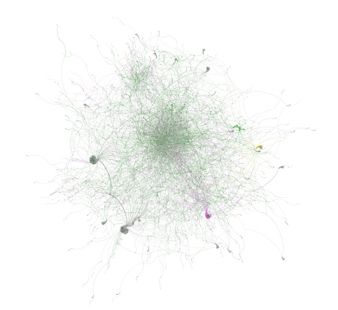
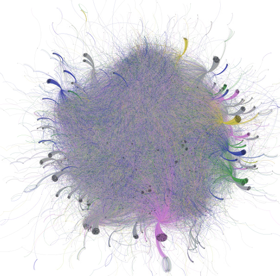
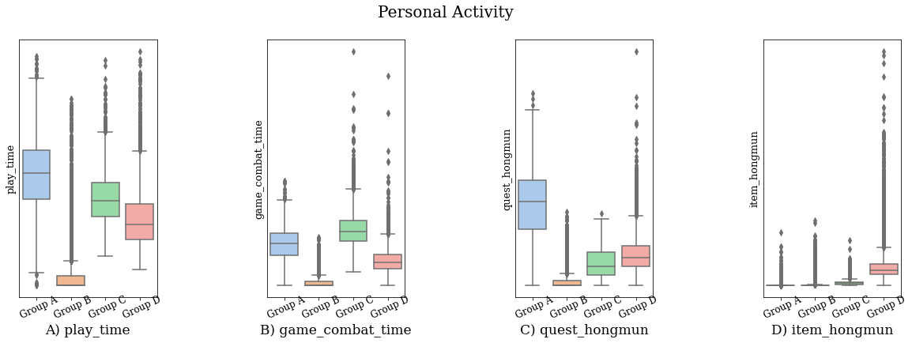
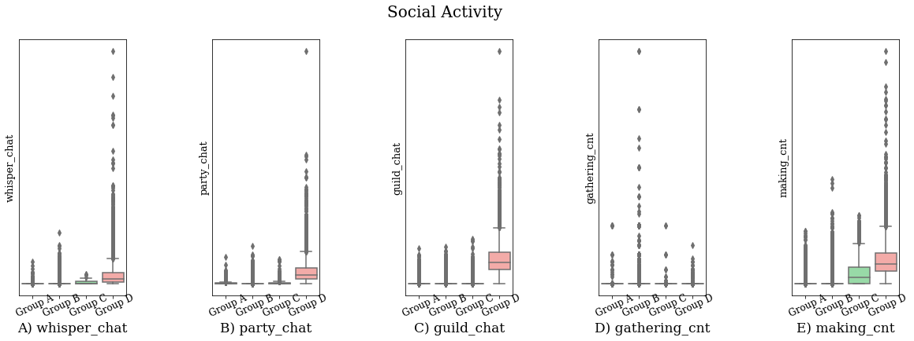

## MMORPG 거래 네트워크 분석을 통한 부정행위 탐지

- [Analysis report](https://zest-cloud-1fd.notion.site/Blade-Soul-gfg-6abc699d108d44838e9f75626798de10)
- [Dataset](https://danbi-ncsoft.github.io/OpenData/)

### Network analysis
게임 내 봇 사용자와 작업장(gold farming group)을 탐지하기 위해, '블레이드&소울'의 거래데이터 1000만건에 대한 네트워크 분석.      
NetworkX 와 Gephi를 사용하여 네트워크 피쳐 분석과 시각화.    

### User clustering
이후 유저들의 인게임 내 활동데이터들을 토대로 봇과 일반 유저의 플레이 스타일에 대한 segmentation을 하여, 특정된 네트워크 노드들과 비교 분석.    

